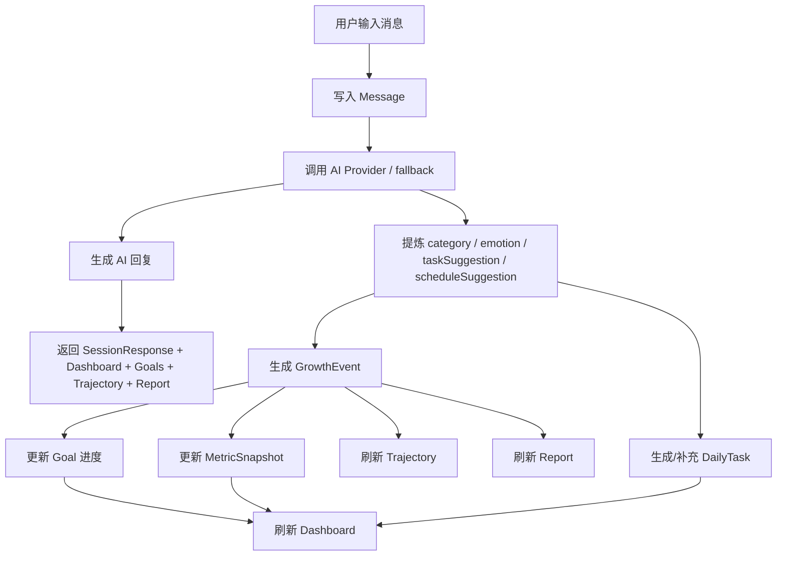
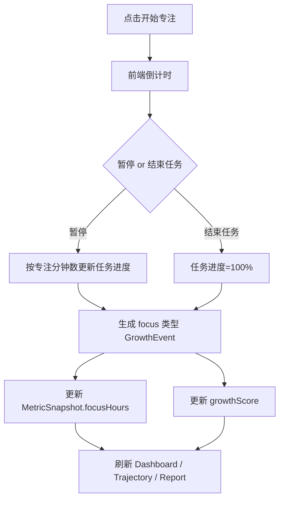
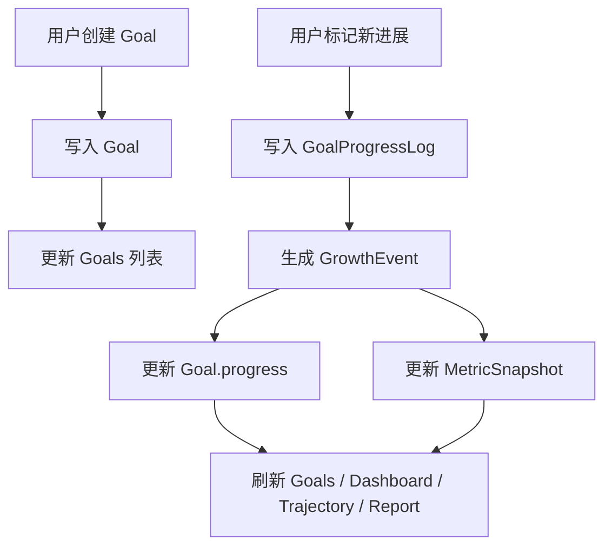
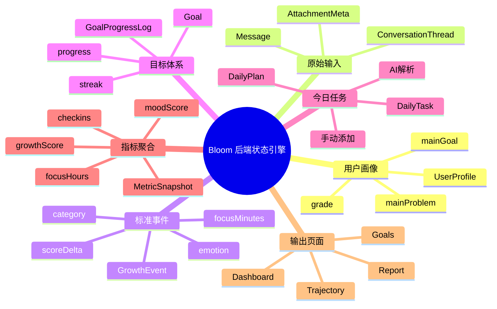

# Bloom 后端规范设计文档

## 1. 目标
本文件用于统一说明 Bloom 当前后端的：
- 数据模型
- 数据之间的关系
- 核心计算公式
- 数据流走向
- AI 参与点
- 当前 Demo 与未来生产化的边界

当前实现定位：
- **前端可展示 Demo + 真实大模型接入入口**
- 核心 AI Provider：**阿里百炼**
- 备用 Provider：**智谱 AI**
- 最终兜底：**fallback 规则逻辑**

---

## 2. 后端职责总览
后端不是简单返回假数据，而是一个围绕成长对话运转的**状态引擎**：

1. 接收用户对话输入
2. 调用 AI / fallback 进行结构化理解
3. 更新成长事件、目标进度、日程、指标快照
4. 聚合出 Dashboard / Trajectory / Report 所需数据
5. 把结果统一返回前端展示

---

## 3. 核心数据模型

### 3.1 用户画像 `UserProfile`
描述用户长期成长背景。

关键字段：
- `name` / `username`
- `grade`
- `growthDirection`
- `mainGoal`
- `mainProblem`
- `joinedAt`

用途：
- 任务生成
- AI 回复上下文
- 报告总结
- 目标优先级判断

---

### 3.2 历史对话 `ConversationThread` / `Message`
#### Thread
- `id`
- `title`
- `preview`
- `updatedAt`
- `lastInputContent`
- `lastInputAt`

#### Message
- `id`
- `threadId`
- `role`
- `content`
- `createdAt`
- `attachments`
- `summary`

用途：
- 作为最重要的原始输入源
- 支撑对话列表、会话详情、AI 记忆回调

---

### 3.3 目标体系 `Goal` / `GoalProgressLog`
#### Goal
- `id`
- `title`
- `category`
- `progress`
- `targetDate`
- `streak`
- `note`

#### GoalProgressLog
- `id`
- `goalId`
- `note`
- `progressDelta`
- `createdAt`

用途：
- 目标看板展示
- 与成长事件、成长值联动
- 为报告与轨迹提供“推进证据”

---

### 3.4 成长事件 `GrowthEvent`
每次重要输入、目标推进、专注结束，最终都会沉淀成标准事件。

关键字段：
- `id`
- `content`
- `date`
- `source`
- `emotion`
- `category`
- `goalIds`
- `scoreDelta`
- `focusMinutes`

用途：
- 成长轨迹时间轴
- 报告亮点
- 关键事件判定
- Dashboard 状态推导

---

### 3.5 今日任务与日程 `DailyPlan` / `DailyTask`
#### DailyPlan
- `focusTitle`
- `focusSubtitle`
- `timeBudgetMinutes`
- `deadline`
- `progress`
- `reminder`
- `tasks`
- `schedule`

#### DailyTask
- `title`
- `time`
- `tag`
- `completed`
- `source`（`manual` / `ai` / `parsed`）

用途：
- 今日成长页的核心任务和日程安排
- 区分用户手动添加和 AI 解析来源

---

### 3.6 每日指标快照 `MetricSnapshot`
这是所有可视化与指标聚合的核心来源。

字段：
- `date`
- `growthScore`
- `focusHours`
- `moodScore`
- `checkins`
- `events`

用途：
- Dashboard 指标
- 本周成长曲线
- 周/月/季/年报告统计
- streak / active days / delta 计算

---

## 4. 数据关系说明

### 关系总览
- **UserProfile** 影响 `DailyPlan` 生成、AI 回复、Goal 判断、Report 总结
- **Message** 是最主要的原始输入源
- **Message → GrowthEvent**：每次有效对话都会提炼成一条或多条成长事件
- **GrowthEvent → MetricSnapshot**：事件更新成长值、专注时长、情绪得分
- **GrowthEvent → Goal**：命中目标时，推动目标进度与 streak
- **GrowthEvent → Trajectory / Report**：用于关键事件、习惯、情绪、亮点生成
- **GoalProgressLog → GrowthEvent**：手动目标推进会反向生成成长事件
- **DailyTask** 可来自 AI 或用户手动添加，并与事件/目标形成上下文关系

---

## 5. 核心计算逻辑

## 5.1 成长值 `growthScore`
### 当前公式
成长值按事件驱动更新，已拆成多因子规则：

- `conversationScore`：用户输入长度与有效表达程度
- `focusScore`：专注时长贡献
- `goalScore`：命中目标数量贡献
- `reflectionScore`：是否包含复盘 / 总结 / 情绪整理
- `event.scoreDelta`：AI / fallback 对本次事件重要性的基础评分

### 当前后端近似公式
```text
growthDelta =
  0.30 * conversationScore +
  0.35 * focusScore +
  0.20 * goalScore +
  0.15 * reflectionScore +
  event.scoreDelta / 2
```

### 解释
- 用户只是随便发一句话，不会得到高成长值
- 用户完成专注、复盘、目标推进，会得到更高成长值
- 成长值上限当前按 Demo 规则限制在 `120`

---

## 5.2 连续成长天数 `streakDays`
### 当前规则
根据 `MetricSnapshot` 倒序检查：
- 如果当天 `checkins > 0`，视为有效成长日
- 连续有效成长日数量即为 `streakDays`

---

## 5.3 活跃天数 `activeDays`
### 当前规则
统计所有 `MetricSnapshot` 中：
- `checkins > 0` 的天数总和

---

## 5.4 累计专注时长 `focusHours`
### 当前规则
对全部 `MetricSnapshot.focusHours` 做累加：
```text
totalFocusHours = Σ metric.focusHours
```

---

## 5.5 虚拟屏幕时长 `screenHours`
### 当前规则
按最近的专注行为反推：
- 专注越多，虚拟屏幕时长越低
- 当前下限为 `3.8h`

示意：
```text
screenHours = max(3.8, 7.2 - focusBursts * 0.2)
```

---

## 5.6 虚拟睡眠时长 `sleepHours`
### 当前规则
按健康类事件数反推：
- 健康行为越多，虚拟睡眠时长略微提升
- 当前上限为 `8.2h`

示意：
```text
sleepHours = min(8.2, 6.4 + recoverySignals * 0.15)
```

---

## 5.7 情绪趋势 `emotionTrend`
### 当前规则
先统计最近事件的情绪分布，得到 `dominantEmotion`：
- `positive`
- `steady`
- `anxious`
- `tired`

再映射为展示文案：
- `positive` → 比上周更积极
- `anxious` → 最近 2 天有点焦虑
- `tired` → 需要适当减压
- `steady` → 近 7 天较为稳定

---

## 5.8 轨迹变化值 `trajectory.overview.delta`
### 当前规则
- 最近 7 天成长值平均数
- 对比前 7 天成长值平均数
- 差值作为 delta

```text
delta = avg(recent 7 days growthScore) - avg(previous 7 days growthScore)
```

---

## 5.9 雷达图 `radar`
### 当前规则
每个能力维度分数由以下因素共同推导：
- 最近事件文本关键词命中
- 目标标题/备注关键词命中
- 最近消息文本关键词命中
- 较高进度目标数量权重

当前维度：
- 产品思维
- 行动执行
- 用户洞察
- 情绪韧性
- 结构表达

---

## 5.10 习惯 `habits`
### 当前规则
从事件与消息中提取重复模式：
- 复盘相关行为
- 固定专注行为
- 健康类行为
- 整理/计划类表达

输出示例：
- 连续记录每日复盘
- 固定进行专注时段
- 每周保持运动节奏
- 睡前整理第二天重点

---

## 5.11 关键事件 `keyEvents`
### 当前规则
每条事件会计算关键性权重，来源包括：
- `scoreDelta`
- 关键关键词命中：
  - 面试
  - offer
  - 决定
  - 突破
  - 复盘
  - 完成
- 命中目标数量
- 情绪波动（积极/焦虑额外加权）

当权重大于等于阈值时，事件会进入：
- 周期报告 highlights
- 轨迹页关键时刻回顾

---

## 5.12 报告 `Report`
### 当前生成逻辑
- `stats`：来自 `MetricSnapshot` / `Goal` / 虚拟睡眠数据聚合
- `highlights`：来自 `keyEvents`
- `title` / `summary` / `nextSuggestion`：当前为**规则主导**，后续可升级为“结构化数据 + AI 生成 + fallback”

当前动态依赖：
- `dominantEmotion`
- `recordDays`
- `totalFocusHours`
- `completedGoals`
- `keyEvents`

---

## 6. AI Provider 逻辑

### 当前优先级
1. **阿里百炼 Bailian**
2. 智谱 AI Zhipu
3. fallback 规则逻辑

### 当前已接入能力
- 成长对话回复
- 今日核心任务生成
- 任务拆解
- 输入记录解析

### 当前可升级能力
- 报告文案总结
- 关键事件摘要增强
- 更强的任务规划与日程编排

---

## 7. 数据流走向

## 7.1 用户发送成长对话时


---

## 7.2 用户进行专注时


---

## 7.3 用户新增目标 / 标记进展时


---

## 8. 数据关系思维导图


---

## 9. 当前实现状态说明

### 已经真实动态化的部分
- 对话驱动 AI 回复
- 对话驱动情绪识别
- 对话驱动成长值变化
- 对话驱动日程建议
- 专注时长累计
- streak / activeDays
- 关键事件筛选
- 雷达图 current 值
- 报告亮点
- Dashboard 提醒
- 阿里百炼真实接管 AI Provider

### 仍然是 Demo/虚拟占位的部分
- 屏幕时长
- 睡眠时长
- 健康接口
- 小红书检索
- RAG 数据库
- 生产级持久化存储

---

## 10. 后续推荐演进方向
1. 把 `title / summary / nextSuggestion` 升级成“结构化数据 + AI 生成 + fallback”
2. 增加真正的 `ConversationExtraction` / `MemoryFact` 结构
3. 将 `MetricSnapshot` 升级为更明确的 `DailyAggregate`
4. 引入数据库持久化，替代当前内存 store
5. 为未来原生端接入 Apple 健康 / 屏幕使用时间预留数据同步接口

---

## 11. 一句话总结
Bloom 当前后端已经从“前端展示的假数据源”演进成一个**围绕成长对话更新事件、目标、指标、轨迹与报告的状态引擎**；所有核心展示数据已经逐步具备可解释的来源与计算路径。
